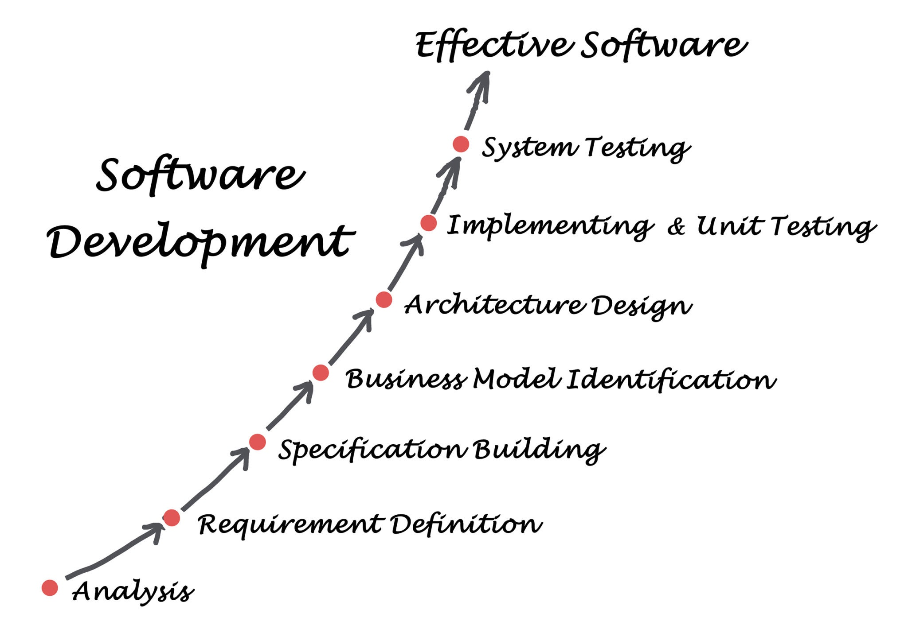

## The Rise of AI Tools (ChatGPT, Copilot, Cursor AI, etc.)

### The workflow of using AI for coding

Chat gpt, github copilot, cursor

- Todas pueden generar código por nosotros, dependiendo de nuestro prompt, usando LLM => `large language models`
- Copilot y cursor nos dan herramientas de auto completado

Sin embargo, al hacer cualquier código, se necesita un workflow definido

### El workflow

- Entender completamente el problema, hacer preguntas para tener un clear picture
- Si el problema es grande, dividirlo en sub problemas
  En lugar de decirme "hazme Instagram", dividirlo en cosas pequeños
- Choose AI and give it a **very specific prompt** and enough context (el lenguaje, el contexto del problema,sobre que trata, que es lo que debería lograr, coding style, etc)
- **Review and test** the output solution. Make sure you introduce no bugs into your app
  Pueden dar una solución mas complicada de la necesaria
  Se le puede pedir que improve the code, diciéndole que esta mal, y que se necesita
- **Integrate** the solution into your app

### Guidelines for safe use of AI

> Before you use AI

1. you need to know **how to code on your own**, fundamental skills are 100% essential
2. You need to be able to **solve problems on your own**
3. You need to have very **critical thinking** (AI code puede contener muchos bugs or bad code)
4. You need to have **curiosity and joy** while coding

> [!IMPORTANT]
> Use AI as an assistant, not a replacement!
> Save time on repetitive and boring tasks, or learning!

### Incorporarte AI code:

1. When you could have **written the code yourself**
   Lo ideal es ya haber pensado en los lineamientos o funciones necesarias para resolver el problema
2. When you **truly understand** the generated code
3. When you have ensured the code is 100% correct => que los errores de la IA no lleguen al código
4. When you're not using the code for **mission critical parts** of your apps

rely on => depender de
mundane => mundane

### Will AI take your JOB?

Software developers do a **lot more than just writing code:** maintain bigger picture of huge projects / think about software/implement complex design principles/ are creative/ they collaborate with other developers and clients

- AI generated code is **still buggy**. and AI is **not very good at debugging**

> [!NOTE]
> Debugging es el proceso de encontrar y corregir errores en un programa, y a estos errores se les conoce como "bugs"
> 
