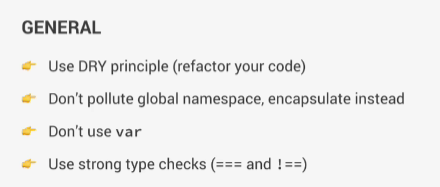
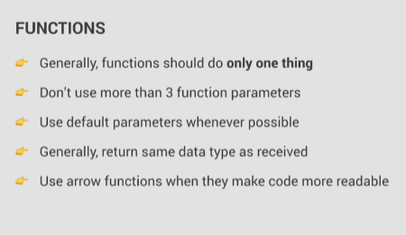
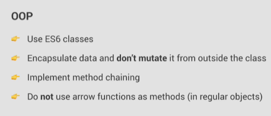

# 📝 Anotaciones Section 17

Estas son las primeras anotaciones hechas con README.md

## Carga de solo modulos en Parcel

```
if (module.hot) module.hot.accept();
npm install parcel -g
npx parcel index.html, parcel build index.html
```

parcel ya usa Babel paara convertir codigo, igual se puede definir:

- 🌐 Que navegadores deberinan ser compatibles

Si entramos a la pagina de Babel, en la parte de plugins, tendrmeos plugins y features configurables un plugin es una función de js que podemos transpilar(convertir)

Si nos vamos a este fragmento:

```
Promise.resolve('TEST').then((res)=>console.log(res));
```

Y lo vemos en los scripts del dist

```
Promise.resolve('TEST').then((res)=>console.log(res));
```

Estan iguales, esto debido a, como las features son realmente nuevas, no se puede convertir este codigo para que sea compatible con las versiones anteriores

Tambien esta esta biblioteca llamad core-js que hace polyfill para que funcione con las versiones mas anteriores

```
// import 'core-js/stable';
import 'core-js/stable/array/find';
```

Mediante la importacion uno asegura que archivos o metodos si convertir y caules no, _siempre siendo al inicio del modulo_

Tambien usamos _regenerator-runtime_ para:

### Polifilling async functions

```
import "regenerator-runtime/runtime"
```

## Para importar modulos js, en el index>head poner:

```
    <script type="module" defer src="script.js"></script>
```

## Writing clean and Modern Javascript

El _!_ es para declarar que es una imagen, sin ese "[texto] (imagen)" seria un enlace clickeable


- Codigo que todos puedan entendere
- Soluciones demasiado inteligentes que sean demasiado complicadas
- Nombres muy descriptivos, (variables sobre lo que contienen, funciones a corde a lo que hacen)



- No hacer cosas repetitivas
- No contaminar los espacios principales, encapsular(agrupar datos en una estructura, ocultado su implementacion) en funciones, clases o modulos
- Usar === en lugar de ==





- Method chaning es poner metodos dentro de las clases para hacerlas mas accesibles
- No usar arrowFun dentro de obj, porque no tienen acceos a la this, pero si se pueden usar como alternativa al bind en callBack functions
- Evitar codigo demasaido anidado (cosas dentro de otras)
- En lugar de if else, usar varios if
- Evitar usar for, o for of, en lugar usar array methods
- Evitar callbacks async cada que se pueda, usar async await en lugar de then catch, evitar cosas muy anidadas
- Si se pueden correr, hacerlo en paralelo, Promise.all, usar error handlers y promise rejections

Los emojis al monento de escribir _slice, siplice_ etc, estos ocupan siempre 2 caracteres

## Declarative and functional Javascript Principles

Hay dos formas diferentes de escribir codigo, o sea paradigmas:

### Imperativo

Explicar a la pc como hacer las cosas, si hago un pastel explico paso a paso como lo realizo

```
const arr = [2,4,6,8]
const doubled = []
for(let i=0; i<arr.lenght; i++){
    doubled[i] = arr[i] * 2
}
```

### Declarativo

Explicar a la pc que hacer, describe la forma en como deberia lograr ese resultado, seria describir como es el pastel

```
const arr = [2,4,6,8]
const doubled = arr.map(n=>n*2)
```

### Functional programming

Combinanndo funciones puras, exitando efectos secundarios y mutando data

- Side Effect: mutar variables externas, hacer console logs, etc
- Pure function: funciones sin efectos, no depende de variables externas(recibe y retorna los mismos inputs)

#### Techniques
- Tratar de evitar mutaciones de la data
- Usar metodos que no produzcan efectos secundarios
- Transformar data con map, filter, reduce
- Evitar efectos secundarios en funciones
- Usar ternarios, spread (...) y las comillas invertidas cada vez que sea posible

Nada que ver pero, en un reduce, el acc siempre se debe retornar hasta el final
```
const reductor = objetito.reduce((acc, val, i) => {
  acc[i] = val;
  return acc;
}, {});
```