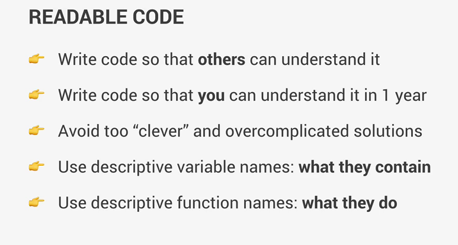

# 📝 Anotaciones Section 17

Estas son las primeras anotaciones hechas con README.md

## Carga de solo modulos en Parcel

```
if (module.hot) module.hot.accept();
npm install parcel -g
npx parcel index.html, parcel build index.html
```

parcel ya usa Babel paara convertir codigo, igual se puede definir:

- 🌐 Que navegadores deberinan ser compatibles

Si entramos a la pagina de Babel, en la parte de plugins, tendrmeos plugins y features configurables un plugin es una función de js que podemos transpilar(convertir)

Si nos vamos a este fragmento:

```
Promise.resolve('TEST').then((res)=>console.log(res));
```

Y lo vemos en los scripts del dist

```
Promise.resolve('TEST').then((res)=>console.log(res));
```

Estan iguales, esto debido a, como las features son realmente nuevas, no se puede convertir este codigo para que sea compatible con las versiones anteriores

Tambien esta esta biblioteca llamad core-js que hace polyfill para que funcione con las versiones mas anteriores

```
// import 'core-js/stable';
import 'core-js/stable/array/find';
```

Mediante la importacion uno asegura que archivos o metodos si convertir y caules no, _siempre siendo al inicio del modulo_

Tambien usamos _regenerator-runtime_ para:

### Polifilling async functions

```
import "regenerator-runtime/runtime"
```

## Para importar modulos js, en el index>head poner:

```
    <script type="module" defer src="script.js"></script>
```

# Writing clean and Modern Javascript


