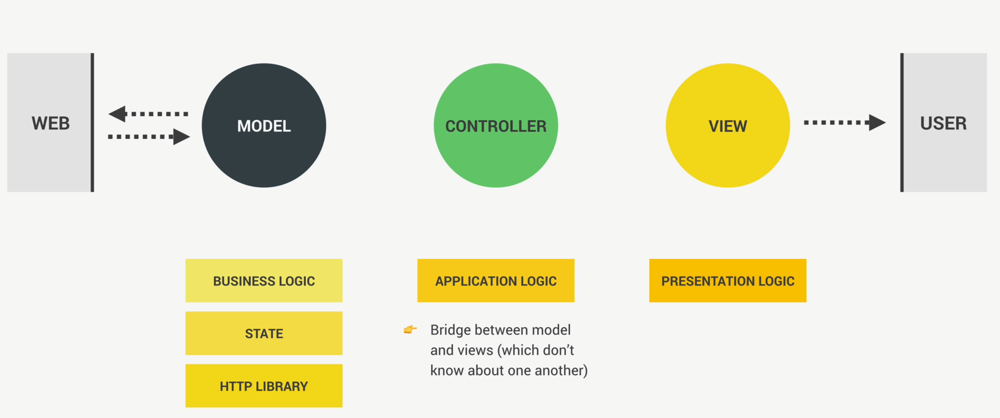
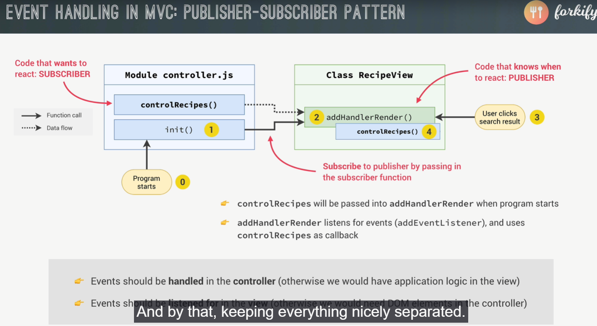

# Forkify App

!(userStore)["./flowChart.png"]

### User story

Es la descripción de la aplicacion por medio de la perspectiva del usuario, por ejemplo

- Como cliente, quiero buscar las recetas, para buscar nuevas ideas de comida
- Como cliente, quiero ser capaz de actualizar el numero de servicios, asi puedo preparar para diferentes cantidades de personas
- Como cliente, quiero un pineado de favoritos, para poder ver las recetas despues
- Quiero crear mis propias recetas, asi puedo tenerlas todas en una misma app
- Quiero ver mis recetas y favoritos aun cuando cierre la app y me vaya

Para los programas de la vida real, se necesitan las peticiones del usuario (user stories) y tambien un diagrama o una manera de ver como va a funcionar la aplicacion en su flujo

Para inicializar un proyecto se pone

```
npm init
```

Para instalar la ultima version de parcel se usa>>ria

```
npm i parcel -D, npm i parcel@2, npm i parcel@next -D
```

Con @ para la version, el @next es para decir la version preliminar, el D es lo mismo que --save-dev

Asimismo, para iniciar una app, en el npm run start, no se necesita el run para acceder al objeto scripts del package.json, sino simplemente poner "npm start"

Cuando se usa sass, se referencia asi en el header:

```
    <link rel="stylesheet" href="src/sass/main.scss" />
```

En parcel ya no se usa el _defer_, sino que por defecto ahora acepta el _type="module"_ que permite el import y export y por defecto ya es defer

Para mandar parámetros en una URL se usa

```
const params = new URLSearchParams({
  search: 'pizza',
  page: 2,
  lang: 'es'
});

const res = await fetch(`https://forkify-api.herokuapp.com/api/v2/recipes?${params}`);
```

Para poner un elemento en diferentes posiciones de un html usamos:

```
    recipeContainer.insertAdjacentHTML('afterbegin', markup);
```

También se usa _innerHTML_ para obtener el valor html que esta dentro de ese Element
Asimismo, si se agrupan varios html en uno solo se puede recibir mejor, con join:

```
          ${recipe.ingredients
            .map(ing => {
              return `<li class="recipe__ingredient">
              <svg class="recipe__icon">
                <use href="src/img/icons.svg#icon-check"></use>
              </svg>
              <div class="recipe__quantity">${ing.quantity}</div>
              <div class="recipe__description">
                <span class="recipe__unit">${ing.unit}</span>
                ${ing.description}
              </div>
            </li>`;
            })
            .join('')}
```

### Pollyfilling

También, para que haya compatibilidad con multiples navegadores, se hace con las bibliotecas core-js y regenerator-runtime, el primero es para cosas generales, y el segundo para _async/await_ features, se usan de esta manera:

```
import "core-js/stable"
import "regenerator-runtime/runtime" //
```

## Listening for Load and hash change Events

Se usa el href del anchor para llevar a otras partes del sitio dentro del html:

```
          <a href="#664c8f193e7aa067e94e8297">RECIPE</a>
```

También se usa _window.location.hash_ para obtener le # de la dirección de la url de nuestra propia pagina

Para captar el estado cada que cambia la url, y cada que carga la pagina se usan:

```
window.addEventListener('hashchange', showRecipe);
window.addEventListener('load', showRecipe);
```

O cuando se tienen varios eventos que se quieren usar con event handler se puede hacer asi:

```
['hashchange', 'load'].forEach(ev => window.addEventListener(ev, showRecipe));
```

## The MVC Architecture

Por que es importante la arquitectura?

- La estructura, es la forma en la que organizamos nuestro código (modulos, clases y funciones)
- Maintainability: Pensamos que le proyecto nunca se termina, y para mejorarlo en el futuro debemos hacerlo fácil de entender, para que también sea escalable
- Expandability: La opción de poner nuevas cosas en el futuro

Pero cuando se hace mas grande, es difícil mantenerlo asi por nuestra cuenta, en lugar de eso usamos estructuras ya establecidas como MVC, MVP, Flux, etc.




Por ejemplo, al pasar algo con el usuario, esto llega al controlador, que distribuye las tareas en caso le toque al modelo, o a la vista actualizar los datos mostrados

Luego si el modelo ocupa hacer una petición se la mandara al controller, que este a su vez hará la lógica de mostrarlo en la vista, el _Model_ y el _View_ nunca se tocan ni saben de la existencia del otro.

Cuando se esta dentro de una clase, se puede asignar información de esta manera:

```
  render(data) {
    this.#data = data; //*Cuando se llama, guarda la data que se le da en esa variable privada
  }
```

Para asi luego acceder desde cualquier parte de la clase como _this.#data_, tampoco importa el orden de los métodos, pueden usarse antes o después de ser creados

### The fractional npm Library (Se usara fracty)

Se usa para presentar los números como fracciones, tipo _1.5_ a _1/2_
Estas dos librerías comenzaron con CommonJS, y ahora para importarlo a ESModules se debe de transformar de esto

```
var fracty = require('fracty') || var Fraction = require('fractional').Fraction
```

A esto:

```
import fractional from "fracty" || import {Fraction} from "fractional"
```

Recuerda, en las clases se pueden llamar funciones antes y después de ser declaradas

### ¿Qué son ESModules y CommonJS?

**ESModules (ESM)** y **CommonJS (CJS)** son dos sistemas diferentes para importar y exportar módulos en JavaScript:

| Característica           | ESModules (ESM)                            | CommonJS (CJS)                                  |
| ------------------------ | ------------------------------------------ | ----------------------------------------------- |
| **Sintaxis**             | `import` / `export`                        | `require` / `module.exports`                    |
| **Soporte en navegador** | Nativo (moderno, sin bundler)              | No soportado directamente en navegador          |
| **Ejecución**            | Estática (analiza imports antes de correr) | Dinámica (los `require()` se ejecutan en orden) |
| **Uso típico**           | Frontend (moderno) / también en Node.js    | Node.js (clásico, antes de ESModules)           |
| **Ejemplo**              | `import x from './x.js'`                   | `const x = require('./x')`                      |

En ES6 Modules, cuando se usa export default, al darle import le ponemos el nombre de queramos, ejemplo:

```
export default new RecipeView();
import recipeView from './views/recipeView.js';
```

También, para importar todo el archivo se usa \*

```
import * as model from './model.js';
```

Y si son funciones declaradas, se importan como objetos

```
export const hola = function(){}
import {hola} from "../"
```

## Helpers and Configuration Files

En el config.js se ponen las constantes que usaran en todo el programa, las que son responsables de definir la data de la aplicación, usando uppercase para las constantes:

```
export const API_URL = 'https://forkify-api.herokuapp.com/api/v2/recipes';
```

Para retornar los errores al otro scope, se usa _throw err_ asi se propaga, asimismo, se maneja un timeout correcto con un promise, de manera asíncrona, Asi:

```
const timeout = function (s) {
  return new Promise(function (_, reject) {
    setTimeout(function () {
      reject(new Error(`Request took too long! Timeout after ${s} second`));
    }, s * 1000);
  });
};
```

Y se mete en un _const res = await Promise.race([fetch(url), timeout(10)])_ para dependiendo del resultado, mandar un error por timeout

Cuando se rechaza una promesa con el _new Promise Reject_, esta inmediatamente lo manda al catch mas cercano, también al usar ese _new Promise((resolve, reject)=>{})_ lo que retorna es dependiendo si la promesa se cumple o se rechaza

## Event Handlers in MVC: Publisher - Suscribe Pattern

Design Patterns en programación son como soluciones standards a ciertos tipos de problemas
En el PSP, el publisher es una parte del código que sabe cuando reaccionar, y el suscriber es la otra parte que quiere reaccionar(el controlador)



Es básicamente, se manda el eventHandler a la parte de la vista, y cuando un evento ocurra, se manda a llamar la lógica del controlador, y no se manda directamente para que se siga ese patron de la no existencia uno del otro

```
const init = function () {
  recipeView.addHandlerRender(controlRecipes);
};

init();
```

## Implementing Error and Success Messages

El throw new Error es donde se origina el error, el throw Error es para redireccionarlo

## Implementing search Results

_Element.closest()_ se usa para buscar hacia arriba en el árbol del DOM, o sea padres, como padres, si se quiere buscar hermanos seria closest y luego querySelector

Ahora bien, como se quiere tener el valor de un hijo dentro del evento submit del form, se hace lo siguiente:

```
  addHandlerSearch(handler) {
    this.#parentEl.addEventListener('submit', function (e) {
      e.preventDefault();
      handler();
    });
  }
```

Asi se previene que se recargue, y luego obteniendo el valor del padre con:

```
  #parentEl = document.querySelector('.search');
  getQuery() {
    const query =  this.#parentEl.querySelector('.search__field').value; //*Como primero se almacena el valor, por eso luego no se limpia
    this.#clearInput()
    return query
  }
```

Se hace la búsqueda con el valor deseado

## Implementing search results: Part 2

Cuando se extiende una clase, también se extienden sus valores, mientras no sean puestos con _#_, pero si son normales o con convención \_\_\_ al inicio del nombre, se puede

### 🔍 ¿Qué pasa exactamente en esta línea?

```js
const markup = this._generateMarkup();
```

- En la clase View, esta línea llama a un método llamado \_generateMarkup().
- Como View no define ese método, JavaScript sube en la cadena y ve si una clase - hija (como RecipeView) lo ha implementado.
- Como RecipeView sí lo define, ese es el método que se usa.

Ahora, para importar imágenes e iconos en parcel se usa esta sintaxis, con el _url:_ al inicio del from:

```
import icons from 'url:../../img/icons.svg'; // Parcel 1
```

Tomaremos este código luego:

```
preview__link--active

<div class="preview__user-generated">
  <svg>
    <use href="${icons}.svg#icon-user"></use>
  </svg>
</div>
```

También usamos

```
if (module.hot) module.hot.accept();
```

## Implementing Pagination - Part 1

Slice no incluye el ultimo valor, por lo que si es slice(0,10) seria del primer, al décimo elemento.
Se toma desde el primer hasta el décimo valor, o sea _(pagina1 - 1) _ 10 = primerValor*, *page*10 = ultimoValor*, eso es lo que se pone en el slice

```
export const getSearchResultsPage = function (page) {
  const start = (page - 1) * state.search.resultsPerPage; //0 valor inicial
  const end = page * state.search.resultsPerPage; //9 valor final
  return state.search.results.slice(start, end);
};
```

_if (module.hot) module.hot.accept()_ Muchas veces este código puede dejar cacheado la data

Se usa _Math.ceil(num)_ para devolver el entero mas lejano, por ejemplo si tengo un 4.2, me dará un 5

Se usa _git branch -m_ para cambiar el nombre de una rama local

Se crea una conexión entre el DOM y el código, usando los `custom data attributes`

### Dataset Attributes

Se usan los dataset para guardar datos en el DOM
como strings, se usa de esta forma:

```
<div data-user-id="123" data-role="admin"></div>
const div = document.querySelector("div");
console.log(div.dataset.userId); // "123"
console.log(div.dataset.role);   // "admin"
```

## Project Planning II

### 💻 Que es core functionality?

En JavaScript, `funcionalidad central o núcleo del lenguaje` se refiere a las capacidades básicas que proporciona el propio lenguaje, sin depender de APIs externas como el DOM o Node.js.

- Para esta parte, se cambiaran las porciones de las recetas (changing the servings), escuchando los eventos de los botones, y cargando de nuevo las porciones
- Cuando se guarde en marcadores, queremos que se sume el seleccionado a la lista de marcadores, y actualizar el botón en al receta, recargandola
- Cuando se de click a esos marcadores, cargar el marcador seleccionado
- También, cargar estos bookMarks en el navegador, para asi leerlos a la proxima vez

### Developing a DOM updating Algorithm

El método `Array.from()` se utiliza para **convertir objetos similares a arrays** (como `NodeList`, `Map`, `Set`, entre otros) en **arrays reales y completamente funcionales**.

```
Array.from(arrayLike, mapFn);
const arr = Array.from({ length: 9 }, (_, i) => i);
console.log(arr); // [0, 1, 2, 3, 4, 5, 6, 7, 8]
```

- El primer arg es el objeto iterable o similar a array que se quiere convertir
- EL seg una función de mapeo opcional, similar a la que se usa en .map(), que puede transformar cada elemento durante la conversión. _(el, i, els)=>{}_

Los _nodos_ es cualquier unidad dentro del árbol del DOM. Existen varios tipos de nodos, no solo los elementos HTML, como el Element, text, Comment, DocumentFragment
Ahora los atributos de un elemento son propiedades del mismo, no nodos como tal

Ahora, se usa document.createRange().createContextualFragment("texto html") para pasar un texto en html a un DOM element, y el querySelectorAll para tener una lista de nodos de todos los elementos al que hace referencia:

```
  const newMarkup = this._generateMarkup();
  // Creara un rango y luego convertirá el string a DOM
  const newDOM = document.createRange().createContextualFragment(newMarkup);
  const newElements = Array.from(newDOM.querySelectorAll('*'));
```

También se usa _firstChild_ para obtener el primer hijo de un elemento, que en caso sea un botón seria texto.
Y _nodeValue_, si es texto retornara eso mismo, y _trim()_ para quitar de un texto los espacios iniciales y finales

````
    newElements.forEach((newEl, i) => {
      const curEl = curELements[i];

      // UPDATE changed TEXT isEqualNode booleano si ambos nodos son iguales, nodeValue devuelve texto en caso sea inputText
      if (
        !newEl.isEqualNode(curEl) &&
        newEl.firstChild?.nodeValue.trim() !== ''
      )
        curEl.textContent = newEl.textContent;

      // UPDATE changed ATTRIBUTES
      if (!newEl.isEqualNode(curEl)) {
        console.log(curEl.attributes); //* lista nodeMap de los atributos
        Array.from(newEl.attributes).forEach(attr =>
          curEl.setAttribute(attr.name, attr.value) //*setAttribute pide un nombre y el valor del atributo
        );
      }
    });
    ```
````

Nuevamente

```
const id = window.location.hash.slice(1);
```

Para obtener la ubicación exacta

## Implementing Bookmarks

para añadir un bookmark, se usan los mismos métodos de información en el model, conexión en el controller y vista en los view, tenemos el método de suma y el de eliminación

### Suma - addBookmark

para la suma simplemente definimos un arreglo de bookmarks, en el cual ponemos el marcado dentro de ese arreglo, y si es igual al id actual que se muestra se mostrara la clase de fill en el DOM.

Para quitarlo, hacemos esto:

```
export const deleteBookmark = function (id) {
  // Delete bookmark
  const index = state.bookmarks.find(el => el.id === id);
  state.bookmarks.splice(index, 1);

  // Mark current recipe as bookmarked
  if (recipe.id === state.recipe.id) state.recipe.bookmarked = false;
};
```

Luego se debe marcar, en caso de que no este marcado, y si lo está, desmarcarlo, por ello se debe usar un if else en lugar de dos condiciones

```
const controlAddBookmark = function () {
  if (!model.state.recipe.bookmarked) model.addBookmark(model.state.recipe);
  else model.deleteBookmark(model.state.recipe.id);

  recipeView.update(model.state.recipe);
}
```

## Implementing Bookmarks - Part 2

### Recapitulacion de comandos

Para inicializar un proyecto se pone

```
npm init // -y si se quiere poner todas las opciones por defecto
```

Para instalar la ultima version de parcel se usa>>ria

```
npm i parcel -D, npm i parcel@2, npm i parcel@next -D // -D es como decir --save-dev
```

_--save-dev_ significa que solo sera como una herramienta de desarrollo

Con @ para la version, el @next es para decir la version preliminar, el D es lo mismo que --save-dev

Tambien se usan:

```
npm i library@latest // Para instalar su ultima version
```

## Storing bookMarks with localStorage

## Uploading a new Recipe

Se usa el metodo _bind_ en la funcion, ya que la keyword _this_ al estar dentro de un eventListener, su this es el elemento al que apunta, pro ejemplo:

```
  toggleWindow() {
    this._overlay.classList.toggle('hidden');
    this._window.classList.toggle('hidden');
  }

  _addHandlerShowWindow() { //*Si no se usara bind, this seria el this._btnOpen
    this._btnOpen.addEventListener('click', this.toggleWindow.bind(this));
  }
```

Tambien, conocemos el fomrulario `form` que tiene un evento especial llamado submit, que envia toda la informacion de sus hijos input, pero en lugar de sacar value por value, usaremos un nuevo API llamado _new Form_

### Uso de New Form

tal como la API de _Intl_, se ocupa crear una instancia new Form(form) y dentro del constructor (primer aguemnto), se mete el label form, y para su uso se usa en un spread dentro de un Array, para obtener su info, asi:

```
const dataArr = [...new FormData(this)]; // Nos dara como un Object.entries()
const data = Object.fromEntries(dataArr)
```

Ahora si lo queremos en un objeto, se usa `Object.fromEntries()` para convertir de un entries [[titulo, valor]] a un objeto

En lugar de la manera tradicional:

```
// Dentro del addEventListener del form
e.target.querySelector(".siu").value //*se busca el hijo dentro del scope de ese padre form
```

Ahora, se debe mandar el objeto con la informacion como un _POST_, para esto primero se setea la data como lo necesite la API, seguido, se debe hacer una peticion con el fetch de toda la vida, pero con estos cambios:

````
    const fetchPro = fetch(url, {
      method: 'POST',
      headers: {
        'Content-Type': 'application/json', // le decimos que el tipoo de contenido a mandar sera en formato json
      },
      body: JSON.stringify(uploadData),
    });
    ```
````

como segundo argumento, se envia un objeto llamado `headers`, que son fragmetnos de de texto, que contienen informacion sobre la solicitud en si.
Por ultimo, se envia otro objeto llamado `body`, donde finalmente se envia la informacion en formato texto, por ello se usa _JSON.stringify(uploadData)_

Truco para poner propiedades opcionales:

```
...(recipe.key && { key: recipe.key }),
```

### window.history API

_window.history_ es la api del historial del navegador, y para cambiar le enlace actual sin recargar la pagina se usa _pushState_

```
    // Change ID in UWL
    window.history.pushState(null, '', `${model.state.recipe.id}`);
    // window.history.back() // Para ir a la pagina anterior
```

## Final Considerations

Hay una manera de documentar funciones que se llama `JS DOCS`
[url], (jsdoc.app)
Se tiene un estandar para la documentacion de funciones, al poner el comando `/**  */` justo encima de una funcion, se abrira un snippet con los args de la funcion, donde podemos especificar que tipo de datos esperan, y si son opcionales los ponemos como _[render = true]_ entre corchetes:

```
  /**
   * Render the received object to the DOM
   * @param {Object | Object[]} data The data to be rendered (e.g. recipe)
   * @param {boolean} [render = true] If false, create markup string instead of rendering to the DOM
   * @returns {undefined | string} A markup string is returned if render=false
   * @this {Object} View instance
   * @author Alberto Zelaya
   * @todo finish implementation
   */
```

Y se vera reflejado al hacer hover al nombre de la funcion, con el patron _@keyword {[valueExpected if optional []]} description_

### Implementing and feature ideas: Challenges 😎

Improvements:

- Display number of pages between the pagination buttons
- Ability to sort search results by duration or number of ingredients
- Perform ingredient validation in view, before submitting the form // por ejemplo advertir que no es un buen formato o consideraciones a tener
- Improve recipe ingredient input: separate in multiple fields and allow more than 6 ingredients.

Aditional features:

- Shopping list feature: button on recipe to add ingredients to a list // poner un boton de agregar ingredientes que los desplegara todos en una lista
- Weekly meal planning feature: assign recipes to the next 7 days and show on a weekly calendar //dropDown menu
- Get nutrition data on each ingredient from spoonacular API (https://spoonacular.com/food-api) and calculate total calores of recipe

## Simple Deployment with Netlify

se usa parcel build index.html para agrupar todo el codigo en una sola carpeta llamada dist("distribution")
para desinstalar paquetes de npm se puede usar _npm un_ en lugar de todo el _npm uninstall_
Tambien, en la version 2, se usan estos detalles en el package.json para evitar problemas con parcel

```
  "default": "index.html", // En el primer nivel
  "build": "parcel build index.html --dist-dir ./dist" // son comandos para distribution directory y luego en donde estara esa carpeta ./dist, dentro del objeto script
```

Para subir el proyecto se puede usar netlify o surge, que este ultimo no ocupa ni iniciar sesion
[surge](https://surge.sh/)
Tambien, al subir los sitios automaticamente se incluye un certificado SSL, y los assets son implementados con una content delievery network _CDN_, lo que significa que se reparten al rededor del mundo, y asi cuando un usuario lo use, se apegara al servidor mas cercano a su region haciendo la carga mas rapida

## Deploying with Git

usaremos git para el control de versiones, y para subir el repositorio se usa:

```
git init // inicializa el repo
git config --global user.name albertozelaya5 // para marcar que este usuario con este correo es el que clona y hace cambios en los reps
git config --global user.email albertozelaya5
git status //para ver el estado de los commits o seguimiento de archivos
git add -A
git reset --hard HEAD //para descartar los cambios no commiteados
git log
git reset --hard numeroDeCommit //para descartar los cambios no commiteados
git reset --hard HEAD~1 //* para descartar el ultimo commit
git branch nuevaBranch
git checkout commit // cambiar entre commits
git merge cambiosNuevaRama
git remote -v // mira el enlace que tiene mi repo
git branch -M nuevo_nombre // cambia el nombre de la rama, el -M es que fuerza ese cambio, si fuera -m no dejaria si hay una ya existente
git push origin nombreRama
git switch -c nombreRama //* lo mismo que checkout pero con switch
```

En el bloc de notas, se usa `q` de _quit_ o :`q`, tambien se puede crear una plantilla como ofrece github para primero hacer el repositorio, clonarlo, trabjar ahi y hacer las modificaciones

## Setting up continous integration with netlify
Tambien se puede vincular un repositorio de gitub para que cuando se haga push, automaticamente se haga un deploy

## Videos nuevos que me faltan por ver
*Seccion 5*
- The rest of AI Tools(ChatGPT, Copilot, Cursor Ai, etc)
- Solving CHALLENGE #2 With Ai

*Seccion 8*
- Memory Management: Garbage Collection

*Seccion 9*
- New Operations to Make Sets Usefull!

*Seccion 11*
- The New findLast and findLastIndex Methods
- CHALLENGE #4
- Array Grouping
- Non-Destructive Alternatives: toReversed, toSorted, toSpliced, with

*Seccion 12*
- Fixing a Sorting Bug

*Seccion 13*
- Fixing a Small Scrolling Bug
